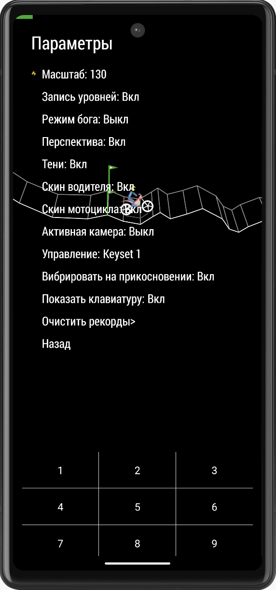
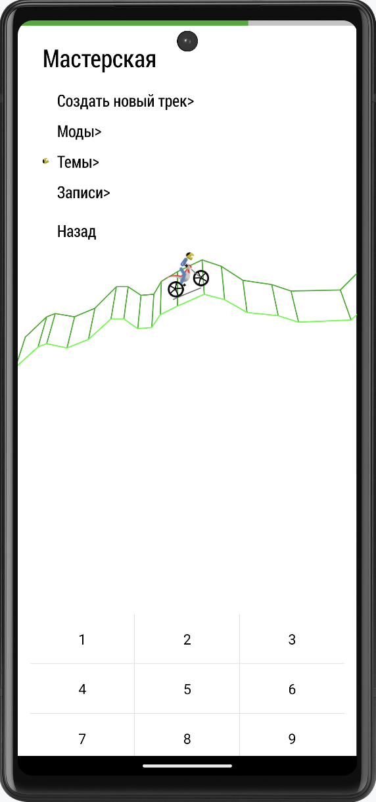
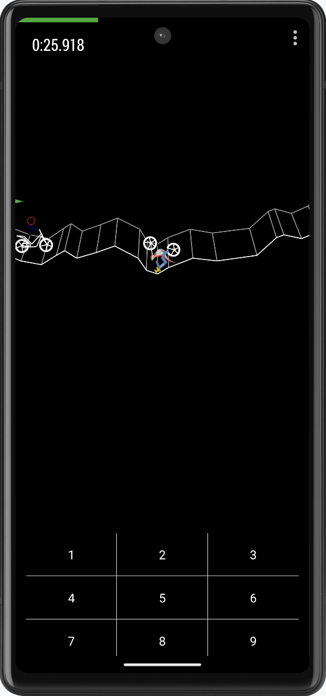

# GDTR Alive!

Based on https://github.com/evgenyzinoviev/gravitydefied with new features:

- Training mode
- Track recorder
- Themes and theme editor
- New mod format
- God mode
- Landscape mode
- Random track mode
- Unlock all
- GamePad support
- Interface scale
- Player name
- Invisible points on track
- Deadline under track
- Finish coordinates check
- Import and sharing game content
- Track editor (beta)
- Achievements (alpha)
- PC version (alpha)
- Core app logic separated from android dependencies
- Refactored internal game components
